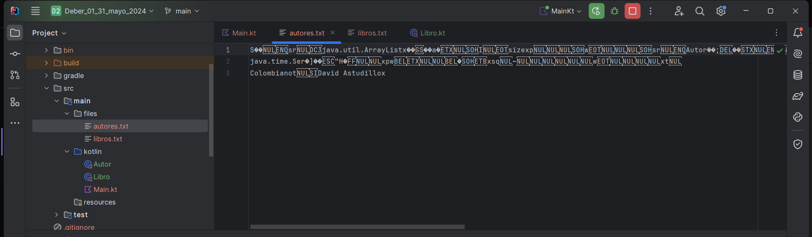

# Escuela Politécnica Nacional

## Aplicaciones Móviles
## Deber 01

### Nombre: David Yánez

Escribir un programa CRUD (Create Read Update Delete). Estas operaciones deben de realizarse en las dos entidades. Las entidades deben de tener 5 datos cada una Ej: Nombre. Entre los 10 datos de las entidades deben de haber las siguientes variables diferentes de Java EJ: Fecha,Booleano, String, Entero, Decimal. Las entidades estan relacionadas de UNO a MUCHOS. En el ejemplo 1 RECETA contiene un arreglo de INGREDIENTES.
Ej:
Receta 1
5 datos
Nombre (str)
Numero Total de ingredientes (int)
etc
Ingrediente N
5 datos
Toda la información se va a guardar en ARCHIVOS

En este caso se uso el escenario de Autotes-Libros.

- **Link video:** https://youtu.be/NmEdFAUoZt4

Los archivos correspondientes a los datos guardados son los siguientes:

