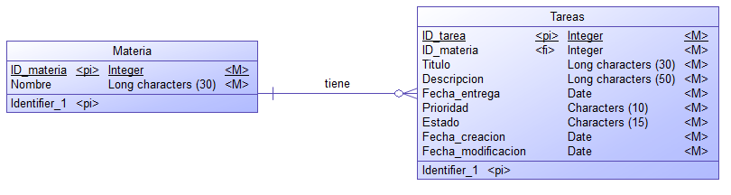

# **ESCUELA POLITÉCNICA NACIONAL**
# **FACULTAD DE INGENIERÍA EN SISTEMAS**
# **APLICACIONES MÓVILES**

## **Diseño de base de datos - PROYECTO 1ER BIMESTRE**

### **Nombre:** David Yanez

- Tablas:

    - Materia: Contiene información sobre las materias.
    
        - materia_id: Identificador único de la materia
        - nombre: Nombre de la materia.

    - Tarea: Contiene información detallada sobre cada tarea.
        - tarea_id: Identificador único de la tarea. 
        - materia_id: Identificador de la materia relacionada (FK).
        - titulo: Título de la tarea.
        - descripcion: Descripción detallada de la tarea
        - fecha_entrega: Fecha límite para completar la tarea.
        - prioridad: Nivel de importancia de la tarea (alta, media, baja).
        - estado: Estado de la tarea (pendiente, completada).
        - fecha_creacion: Fecha en que la tarea fue creada.
        - fecha_modificacion: Fecha de la última modificación de la tarea.

    ### Modelo lógico:

    